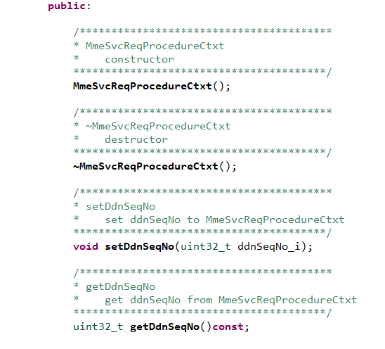

# State Machine Framework

## Table of contents
[Introduction](#introduction)

[State Machine Base Framework](#state-machine-base-framework)

>[Application Building Blocks](#application-building-blocks)

>[Data Structure Arrangement](#data-structure-arrangement)

>[State Machine Design](#state-machine-design)

>[State Machine Runtime](#state-machine-runtime)

[Context Management Framework](#context-management-framework)

[IPC Mechanism](#ipc-mechanism)

[Threading Model](#threading-model)

[Code Generation for State Machine and Context Manager](#code-generation-for-state-machine-and-context-manager)

>[State Machine code generation](#state-machine-code-generation)

>[Context Manager code generation](#context-manager-code-generation)

## Introduction

State Machine framework has been designed with the idea to create a highly modular and generic framework that aids in code generation and automation of most of the functions. The overall high level functionality shall be specified in a JSON data model and the framework shall create the required software objects using the JSON model. The JSON model itself shall be generated using a GUI front end.

Once the base framework is ready, we should be able to build complex designs rapidly through the front end. 

 
The figure above shows the overall concept. The code generator generates application specific code that can be compiled and linked with the base framework and built as a single executable. This executable runs as a service within a docker container. Multiple such applications interacting together in a coordinated fashion will realize a single VNF like MME. The code generator and the State Machine Base Framework shown in the figure above are in the scope of this project.

## State Machine Base Framework

## Application Building Blocks

Every application has certain basic building blocks that together helps in realizing the functional requirements set out for the application. 

Every application is made up of interfaces and procedures. The external world (another application or network element) interacts with the application through the interfaces. The design and implementation of the interfaces is out of the scope of this project.

 
Procedures are the state machines that implements the application's requirements. Each application is made up of a list of procedures. Procedure is a state machine that has a particular externally visible functionality. For example: Attach is a procedure in the MME or SGW control plane. Each procedure goes through multiple states. State is a point in the procedure where the execution logic waits for an external trigger like a message from another network element. Events trigger the processing logic of the procedure when it is waiting in a state. Triggering of the event in a particular state can result in the execution of one or more actions. Each action has a handler that has the core logic of the application which is the only place where the application designer will be required to write code.

Each state can be configured with a state guard timer duration value. The framework starts and stops the timer through the entry and exit functions defined for the states. On timer expiry, application is expected to fire a 'STATE_GUARD_TIMEOUT' event. All the states with non-zero duration must handle this event to clean up the procedure gracefully to avoid the procedure being stuck on a specifc state for too long.  
The guard timer duration is configured in the state machine data model. By default, the feature will be ON. It can be turned off at the procedure level by adding a property 'stateGuardTimerFeature' to the procedure and setting it to 'disabled'.

## Data Structure Arrangement

 
## State Machine Design

 
## State Machine (Runtime)

 
# Context Management Framework

Context Management Framework provides a set of components at the generic and application level for managing the permanent and temporary data for the application. At the generic framework level, it consists of the following components:

**1. Data Group Manager**:
This component is responsible for maintaining the control block storage. During the application startup, the control blocks are       pre-allocated and added into an indexed storage container as well as a free list. During allocation, the control block is removed from         the free list and a pointer to the control block is returned to the application. Similarly, during deallocation, the control blocks is         put back into the end of the free list. 

**2. Memory Pool Manager**:
Mem Pool Manager pre-allocates the memory for temporary and permanent data blocks. Allocation and deallocation happens via a free list of memory blocks held by the mem pool manager. It is a template based class and the instantiation has to be done for each temporary / permanent data block by the APIs provided by the application level context manager components.

 
The DataGroupManager and MemPoolManager are extended by the application for managing the application level data.

**3. Data Block**:
A data block represents the permanent or temporary data of the application. It is derived either from PermanatDataBlock class or TemporaryDataBlock class.

 
**4. Block Pool Manager**:
Block pool manager is the concrete instantiation of the MemPoolManager for a specific type of data block.

 

**5. SubsDataGroupManager**:
SubsDataGroupManager specializes the DataGroupManager and holds the block pool managers for the data blocks used by the application. Application access the context manager functionalities by the APIs provided by this class. SubsDataGroupManager also stores key map structures to allow lookup of the control block via different parameters used by the application. 

  

**6. JSON Data Model**:
Defines the data model for the data blocks. This data model is used for the code generation of the application level components of the context manager.

 

# IPC Mechanism

TIPC has been selected for the IPC mechanism as it provides below advantage:
1.   Support addressing of multiple instances of an application via its service addressing schemes.
1.   Support communication between applications running on different nodes (but belonging to the same cluster)
1.   Support service discovery via subscription to a TIPC topology server.

Each application opens a server socket to listen to incoming IPC messages and a client socket to send outgoing IPC messages.

 

  
 
# Threading Model

MME application uses four main threads as shown in figure: 

  
 
First thread reads the message from the TIPC socket and places it on a message buffer queue. The message handler thread examines the message and determines the control block for which the message is intended and generates an event. The event is queued in the event queue maintained by the control block and placed on to the procedure queue. State Machine thread picks the control block and process the event. Any outgoing message from the message handler thread is sent out through the Egress Message Processor thread.

# Code Generation for State Machine and Context Manager

The implementation of the state machine is automated using the code generation script provided with MME. Following artefacts are required for the code generation used by MME:

1. Template-Toolkit-Python – this is an open source template processing package available in python and perl.

2. Code generation script:
    *   Located in <TOP_DIR>/scripts/codeGen.py

3.  DataModel:
    *   stateMachineAppModel.json which is the data model for the code generation. This defines the state machine for the MME procedures.
    *   ctxtManagerAppModel.json which is data model for the code generation. This defines the context manager for the MME procedures.
    *   generationItem.json – which defines the entities to be generated by the script, the output dir etc.
    *   Located in <TOP_DIR>/scripts/dataModels

4.  C++ class template files
    *   The template files used for code generation. Uses the APIs provided by the template tool kit.
    *   Located in <TOP_DIR>/scripts/templates

## State Machine code generation

**Steps for State Machine code generation:**
1.  Write the procedure definition in the stateMachineAppModel.json

  

2.  Specify the components to be generated by the codeGen in the generationItem.json in below format

 

3.  Specify the state guard timer duration if applicable.
Note: The states waiting on internal events does not require state guard timers. The duration has to be explicitly set to '0' for such states.

 

4.  If the guard timer has to be disabled at the procedure level, add the property 'stateGuardTimerFeature'

 
 
5.  Execute codeGen.py

**Output:** 

a.  actionHandlers.h
*   Copy to <TOP_DIR>/include/mme-app/actionHandlers
*   Functions generated in below format:

 
 
b.  <ProcedureName>ActionHandlers.cpp
*   Copy to <TOP_DIR>/src/mme-app/actionHandlers
*   These files contain both manual and auto generated code. Once generated for the first time, new actions are appended to the end of the file.

 
c.  <StateName>.h – Defines each state
*   Copy to <TOP_DIR>/include/mme-app/mmeStates

 

d.  <StateName>.cpp – Implements the state, populate the event table
*   Copy to <TOP_DIR>/src/mme-app/mmeStates

  

e.  mmeSmDefs.h – States and Events specific to MME-App are defined.
*   Copy to <TOP_DIR>/include/mme-app

f.  mmeSmDefs.cpp - Populate the eventIdToString and StateIdToString Maps, which aids State Machine in fetching the current Event and State.
*   Copy to <TOP_DIR>/src/mme-app

## Context Manager code generation

**Steps for Context Manager code generation:**

1.  Write the context definition in the ctxtManagerAppModel.json

* **Rules to define 'data' field in the Context Manager data model**  

  The data member has to be defined in the below format:  
  a) "Name" :  
  *  Mandatory  
  *  Defines the name of the data member.

  b) "Type" :  
  *  Mandatory
  *  Defines the type of the data member.  
  *  Supported types:  
  1. All the  built-in c++ types such as unsigned int, char etc.  
    eg : **"Type": "unsigned int"**  
  2. Enumeration defined as below:  
    eg : **"Type": "enum UE_State_e"** ie, "enum enumName"  
  3. Pointer type:  
    eg : **"Type": "MmeTimerContext\*"** or **"Type": "MmeTimerContext \*"**

  c) "Cardinality" :  
  *  Defines the data member as an array. The number of element in the array is equal to the value specified in the cardinality.  
  *  If cardinality is defined, the script will generate a length member to which the cardinality value will be assigned.  
  <pre>eg :
     {
        "Name": "pcoOptions",
        "Type": "unsigned char",
        "Cardinality": "256"
     }</pre>  
  *  In above case,the script will automaticaly generate a member named pcoOptionsLen.
    
  d) "DefaultVal" :  

  *  Defines default value for the data.  
  *  For Integer Types, it is assigned as 0 implicitly.  
  *  For Array Types, the members are memset in the constructor.  
  *  For Pointer Types, it is assigned as NULL.  
  
  e) "Properties" :

  * It's an array where you can specify various properties for the data member. Possible parameters are listed below:
	  * metrics : "counter"/"gauge".
	    * If metrics value is "counter", the script will generate a method to increment the data member.
	    * If metrics value is "gauge", the script will generate both increment and decrement method for data member.
    
		  <pre>eg :
			 {
				 "Name": "dwnLnkSeqNo",
				 "Type": "uint16_t",
				 "Properties" : [ {"metrics":"counter"}]
			 }</pre>
			 
	  * accessor : "mutable".
	    * If accessor value is "mutable", the script will generate the setter and getter of the non-POD data member without "const &" modifier.

		  <pre>eg :
			 {
				 "Name": "ueSecInfo",
				 "Type": "Secinfo",
				 "Properties" : [ {"accessor":"mutable"}]
			 }</pre>
	 

2.  Specify the components to be generated by the codeGen in the generationItem.json in below format:

 
3.  Execute codeGen.py

**Output:** 

a.  dataBlocks.h
*   Copy to <TOP_DIR>/include/mme-app/contextManager
*   Functions generated in below format:

 
b.  dataBlocks.cpp
*   Copy to <TOP_DIR>/src/mme-app/ contextManager

 
c.  <BlockName>Manager.h – Defines each context manager

*   Copy to <TOP_DIR>/include/mme-app/ contextManager

 

d.  <BlockName>Manager.cpp 
*   Copy to <TOP_DIR>/src /mme-app/ contextManager

  

e.  subsDataGroupManager.h
*   Copy to <TOP_DIR>/include/mme-app/ contextManager

 

    
f.  subsDataGroupManager.cpp
*   Copy to <TOP_DIR>/src /mme-app/ contextManager

 
 

